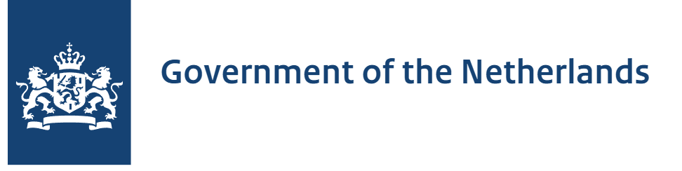
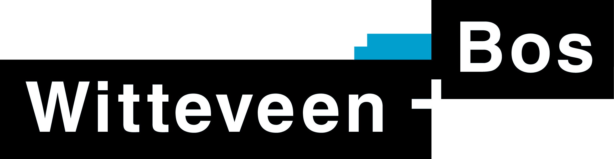
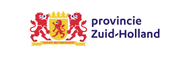

<p align="center">
  
</p>

# TIP: tool for integral programming

#### TIP is a policy decision support toolkit for spatial energy planning.

TIP helps users inspect, modify, and analyze energy system scenarios with immediate visualization of impacts on energy balance and grid infrastructure.

 It is in essence a spatially explicit representation of [Energy Transition Model](https://energytransitionmodel.com/about) scenarios.

### ✨ Features ✨

- 🤝 **Supports collaborative decision-making between municipalities, grid operators, and stakeholders**
- 📊 **Real-time calculations based on the Energy Transition Model (ETM)**
- 🔧 Simple parameter adjustment interface
- 📈 Detailed energy balance analysis
- 🔄 Side-by-side comparison of multiple energy scenarios
- 🗺️ Interactive map visualization of energy impact
- 🌐 Originally designed for PMIEK process, but applicable to any spatial energy planning challenge


## Getting started

For a new deployment of this tool follow the instructions to start a new project as outlined in '[start a new project](docs/start-new-project.md)'.

For local development; follow these steps:  
1. Configure and run the scripts in the `/pipelines` 
2. Use VScode to open dev containers for both the `/app` as the `/hail` folders
3. In the `/app` dev container, start the client and backend with 2 terminals:
   1. `cd frontend && npm run dev`
   2. `cd src && python manage.py runserver`
4. Navigate to;
   1. https://localhost:3000 for the client
   2. https://localhost:8000 for the backend
   3. https://localhost:7000/docs for the Hail microservice
   4. Redis, Postgres and PGadmin will be running as supporting services
5. Refer to the README files in each of the folders for more detailed information. 

## Overview

```bash
# Repo stucture
TIP
├── app
├── docs
├── hail
└── pipelines
```

### App (Next/Django)
The full stack client application is found in the `/app` folder. Refer to `app/frontend` for the code of the NextJS frontend application. Python Django backend is located in the `app/src` folder. 

The client stores  the intermediate and unsaved data in session storage. The backend is used to make this app stateful over sessions by allowing users to submit their unsaved data to a database. Lastly, this backend serves static assets such as images and shape objects (GeoJSON).

Refer to the [README](app/README.md) for installation and getting started.

### Docs
Plain .md documentation. Documentation is scarce and under development. Please refer to the [/docs](docs/index.md) folder. 

### Hail (FastAPI/Redis)
The TIP calculation core. This stateless microservice has three core functionalities:
1. Orchestrate API calls to the ETM based on 'meta-programming' done in `/hail/config`;
2. Handle the dataflows to and from the ETM and client, translating and manipulating data where required;
3. Cache unchanged results using Redis to alleviate the ETM engine and majorly boost performance.

Hail also introduces a convenient syntax in plain Python code that allows energy modelers to focus on computation logic. Hail handles all the API calls - copying and updating ETM scenarios, data validation, caching, arbitrary width logic, interfacing and context management.

Refer to the [README](hail/README.md) for installation and getting started.

### Pipelines
Collection of scripts to load and transform the data required to start an instance of TIP for a new project. Refer to '[start a new project](docs/start-new-project.md)' to use the pipelines to populate the `/app` and `/hail` with the right data and configuration. 

## License and copyright

- TIP is licensed under GPL-3.0, see [LICENSE](LICENSE). 
- Copyright is held by the Ministry of Climate Policy and Green Growth and the Province of Zuid-Holland, see the [LICENSE header](LICENSE-header.md).
- Any content (figures and texts) on the client application are licensed under CC-BY-SA ([link](https://creativecommons.org/licenses/by-sa/4.0/deed.en))
- All data produced by TIP is public domain (CC0, [link](https://creativecommons.org/publicdomain/zero/1.0/deed.en)) and can be used without any restrictions

## Acknowledgements

This product was developed by Witteveen+Bos and is a result of a development project ordered by the Province of Zuid-Holland and the Ministry of Climate Policy and Green Growth.

<div align="center">
  
  
  
</div>
